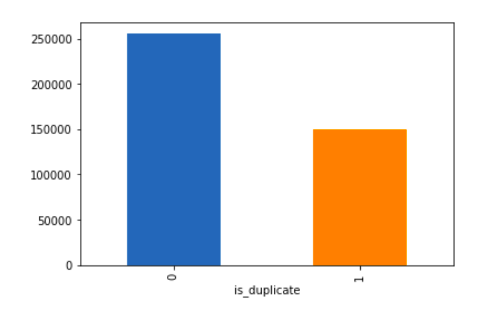

<html>
<head>
</head>
 <body>

 <h1> Quora-Question-Pair-Similarity</h1>
   <h2>1. Business Problem </h2>
   <h3>1.1 Description </h3>

Quora is a place to gain and share knowledge—about anything. It’s a platform to ask questions and connect with people who contribute unique insights and quality answers. This empowers people to learn from each other and to better understand the world.

Over 100 million people visit Quora every month, so it's no surprise that many people ask similarly worded questions. Multiple questions with the same intent can cause seekers to spend more time finding the best answer to their question, and make writers feel they need to answer multiple versions of the same question. Quora values canonical questions because they provide a better experience to active seekers and writers, and offer more value to both of these groups in the long term.

Credits: Kaggle

Problem Statement

Identify which questions asked on Quora are duplicates of questions that have already been asked.
This could be useful to instantly provide answers to questions that have already been answered.
We are tasked with predicting whether a pair of questions are duplicates or not.

 <h3>1.2 Sources/Useful Links</h3>

   Source : https://www.kaggle.com/c/quora-question-pairs

Useful Links
Discussions : https://www.kaggle.com/anokas/data-analysis-xgboost-starter-0-35460-lb/comments 
Kaggle Winning Solution and other approaches: https://www.dropbox.com/sh/93968nfnrzh8bp5/AACZdtsApc1QSTQc7X0H3QZ5a?dl=0 
Blog 1 : https://engineering.quora.com/Semantic-Question-Matching-with-Deep-Learning 
Blog 2 : https://towardsdatascience.com/identifying-duplicate-questions-on-quora-top-12-on-kaggle-4c1cf93f1c30 
   

   <h3>1.3 Real world/Business Objectives and Constraints </h3>
   <ul>
<li>The cost of a mis-classification can be very high.</li>
<li>You would want a probability of a pair of questions to be duplicates so that you can choose any threshold of choice.</li>
<li>No strict latency concerns.</li>
<li>Interpretability is partially important.</li>
     </ul>
   <h2>2.Dataset</h2>
<h3>2.1.Data Overview </h3>
  <ul>
  <li> Data will be in a file Train.csv</li>
    <li>Train.csv contains 5 columns : qid1, qid2, question1, question2, is_duplicate.</li>
    <li> Size of Train.csv - 60MB.</li>
    <li>Number of rows in Train.csv = 404,290.</li>
  </ul>

   <h4> 2.1.1 Example Data points </h4>
 <table>
   <tr>
   <th>id</th>
     <th>qid</th>
     <th>qid2</th>
     <th>question1</th>
     <th>question2</th>
     <th>is_duplicate</th>
   </tr>
<tr>
     <td>0</td>
      <td>1</td>
      <td>2</td>
   <td>What is the step by step guide to invest in share market in india ?</td>
   <td>What is the step by step guide to invest in share market ?</td>
  <td>0</td>
   </tr>
   <tr>
     <td>1</td>
     <td>3</td>
     <td>4</td>
     <td>What is the story of Kohinoor (Koh-i-Noor) Diamond?</td>
     <td>What would happen if the Indian government stole the Kohinoor (Koh-i-Noor) diamond back?</td>
     <td>0</td>
     </tr>
     <tr>
     <td>7</td>
     <td>15</td>
     <td>16</td>
     <td>How can I be a good geologist?</td>
     <td>What should I do to be a great geologist?</td>
     <td>1</td>
     </tr>
    <tr>
     <td>11</td>
     <td>23</td>
     <td>24</td>
     <td>How do I read and find my YouTube comments?</td>
     <td>How can I see all my Youtube comments?</td>
     <td>1</td>
     </tr>
   </table>
<h4> 2.1.2 Distribution of data points among output classes</h4>
  

 <h2>3.Data Preprocessing</h2>
    <h4> 3.1.Description of features </h4>
  

  We are given a minimal number of data fields here, consisting of: 
   <ul>
    <li><b>id</b>:  Looks like a simple rowID</li>
    <li><b>qid{</b>1, 2}:  The unique ID of each question in the pair</li>
    <li><b>question</b>{1, 2}:  The actual textual contents of the questions.</li>
    <li><b>is_duplicate</b>:  The label that we are trying to predict - whether the two questions are duplicates of each other. </li>
  </ul>    
    

   
   <h3> 3.2 Preprocessing of Text </h2>
 - These are the following that we followeed during text preprocessing :
    <ul>
     <li>Removing html tags </li>
     <li>Removing Punctuations</li>
     <li>Performing stemming</li>
     <li> Removing Stopwords</li>
     <li>Expanding contractions etc</li>
 </ul>
 <h2>4.Feature Extraction</h2>
 <h3>4.1 Basic Feature Exteaction </h3>
 Initially, we constructed few features like: 
 
  
 - ____freq_qid1____ = Frequency of qid1's
 
 - ____freq_qid2____ = Frequency of qid2's 
 - ____q1len____ = Length of q1
 - ____q2len____ = Length of q2
 - ____q1_n_words____ = Number of words in Question 1
 - ____q2_n_words____ = Number of words in Question 2
 - ____word_Common____ = (Number of common unique words in Question 1 and Question 2)
 - ____word_Total____ =(Total num of words in Question 1 + Total num of words in Question 2)
 - ____word_share____ = (word_common)/(word_Total)
 - ____freq_q1+freq_q2____ = sum total of frequency of qid1 and qid2 
 - ____freq_q1-freq_q2____ = absolute difference of frequency of qid1 and qid2 

 
 <h3>4.2 Advance Feature Exteaction </h3>
  
  Definition:
- __Token__: You get a token by splitting sentence a space
- __Stop_Word__ : stop words as per NLTK.
- __Word__ : A token that is not a stop_word
 

 We have tried some advanced features which are as follows : 

  
- __cwc_min__ :  Ratio of common_word_count to min lenghth of word count of Q1 and Q2  cwc_min = common_word_count / (min(len(q1_words), len(q2_words))
 
 
  
  
- __cwc_max__ :  Ratio of common_word_count to max lenghth of word count of Q1 and Q2  cwc_max = common_word_count / (max(len(q1_words), len(q2_words))
 
 
  
- __csc_min__ :  Ratio of common_stop_count to min lenghth of stop count of Q1 and Q2   csc_min = common_stop_count / (min(len(q1_stops), len(q2_stops))
 
 
  
- __csc_max__ :  Ratio of common_stop_count to max lenghth of stop count of Q1 and Q2 csc_max = common_stop_count / (max(len(q1_stops), len(q2_stops))
 
 
  
- __ctc_min__ :  Ratio of common_token_count to min lenghth of token count of Q1 and Q2 ctc_min = common_token_count / (min(len(q1_tokens), len(q2_tokens))
 
 

- __ctc_max__ :  Ratio of common_token_count to max lenghth of token count of Q1 and Q2 ctc_max = common_token_count / (max(len(q1_tokens), len(q2_tokens))
 
 
        
- __last_word_eq__ :  Check if First word of both questions is equal or not last_word_eq = int(q1_tokens[-1] == q2_tokens[-1])
 
 

- __first_word_eq__ :  Check if First word of both questions is equal or not first_word_eq = int(q1_tokens[0] == q2_tokens[0])
 
 
        
- __abs_len_diff__ :  Abs. length difference abs_len_diff = abs(len(q1_tokens) - len(q2_tokens))
 
 

- __mean_len__ :  Average Token Length of both Questions mean_len = (len(q1_tokens) + len(q2_tokens))/2
 
 

- __fuzz_ratio__ :  https://github.com/seatgeek/fuzzywuzzy#usage
http://chairnerd.seatgeek.com/fuzzywuzzy-fuzzy-string-matching-in-python/
 
 

- __fuzz_partial_ratio__ :  https://github.com/seatgeek/fuzzywuzzy#usage
http://chairnerd.seatgeek.com/fuzzywuzzy-fuzzy-string-matching-in-python/
 
 

- __token_sort_ratio__ : https://github.com/seatgeek/fuzzywuzzy#usage
http://chairnerd.seatgeek.com/fuzzywuzzy-fuzzy-string-matching-in-python/
 
 

- __token_set_ratio__ : https://github.com/seatgeek/fuzzywuzzy#usage
http://chairnerd.seatgeek.com/fuzzywuzzy-fuzzy-string-matching-in-python/
 
 

- __longest_substr_ratio__ :  Ratio of length longest common substring to min lenghth of token count of Q1 and Q2 longest_substr_ratio = len(longest common substring) / (min(len(q1_tokens), len(q2_tokens))

   <h2> 3. Machine Learning Problem </h2>
   <h3>3.1Mapping the real world problem to an ML problem </h3>
   <h4>3.1.1 Type of Machine Leaning Problem </h4>
It is a binary classification problem, for a given pair of questions we need to predict if they are duplicate or not.

   <h4>3.1.2 Performance Metric </h4>
Source: https://www.kaggle.com/c/quora-question-pairs#evaluation

Metric(s):

log-loss : https://www.kaggle.com/wiki/LogarithmicLoss
Binary Confusion Matrix
   <h3> 3.2 Train and Test and CV Construction </h3>
We build train and test by randomly splitting in the ratio of 50:30:20
</body>
</html>
